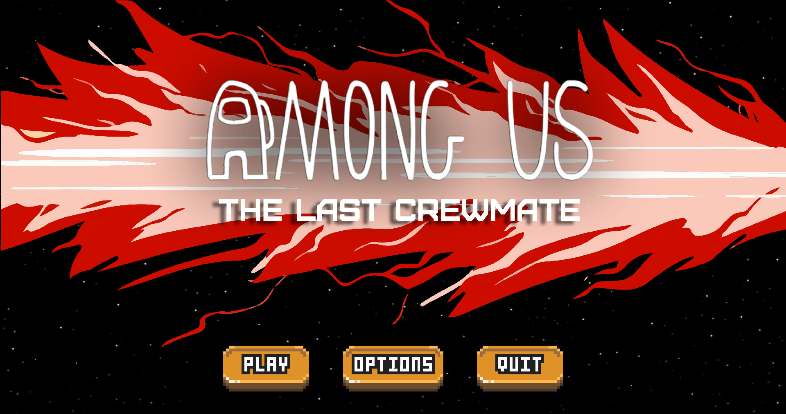
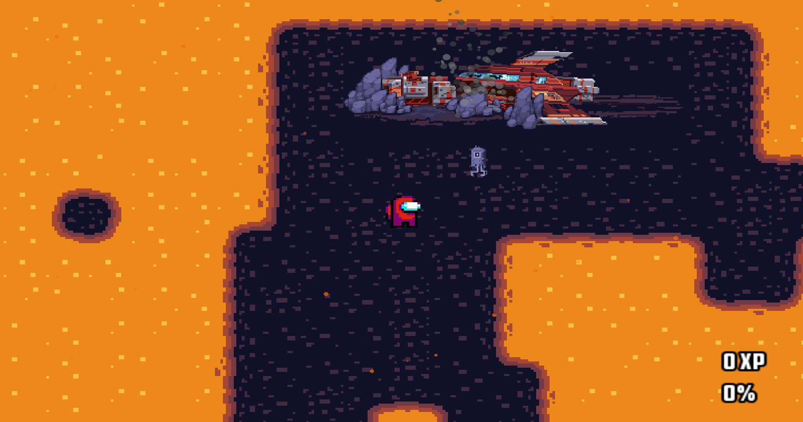
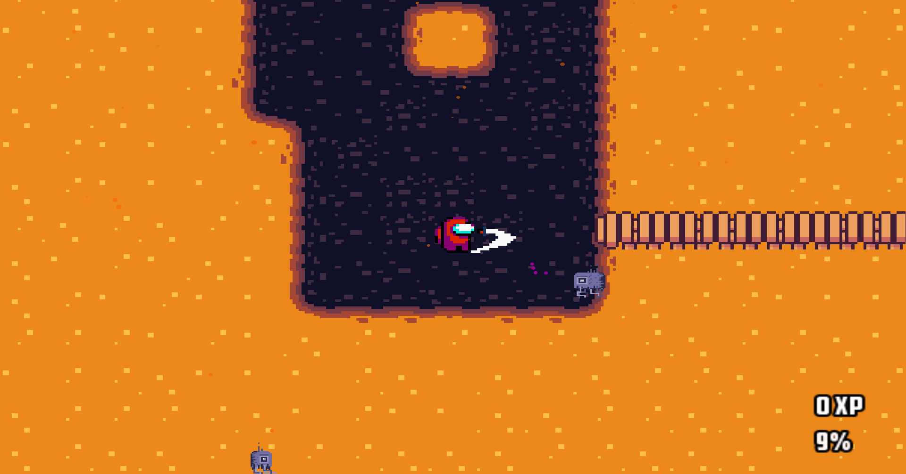

# **Among Us - The Last Crewmate**

## **Introduction**
---

**Among Us - The Last Crewmate** is a game created and developped by [Gabriel Lepinay](https://github.com/lepinay-gabriel), [Valentin Py](https://github.com/ValentinPy1), [Paul Thiebault](https://github.com/PaulThblt) and [Felix Stavonhagen](https://github.com/Felixsta123).

This is the MyRpg Epitech's project.

## **Table of content**
---
- Installation
  - Download
  - Compile and run the game
- Synopsis
- How to play
- Features

## Installation
---
1. Download

Prerequisites: You need to be on linux and have csfml installed.
To download the game click on the green button on the top right of the repository.

2. Compile the game and run it

To compile the game use `make` and run it with `./my_rpg` use `./my_rpg -d` to launch with debug mode

3. Play

Have fun :)

## Synopsis
---
*In a final attempt to kill the last crewmate, the imposters crashed the ship.*

*Now sole survivor of his team, RED has to find the lost vent located in the planet's core in a deperate attempt to vent to safety.*

## How to play
---
Use `zqsd` or `arrows` to walk.

Use `e` to interact.

Use `space` to attack.

Use `escape` to see stats and option.

## Features
---
### 1. Config file to build scene
### 2. Config file to build map

